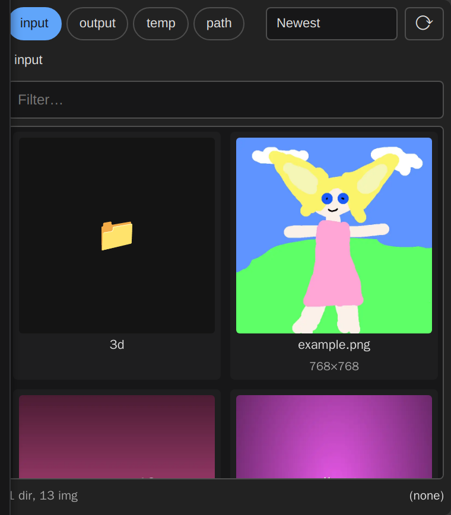
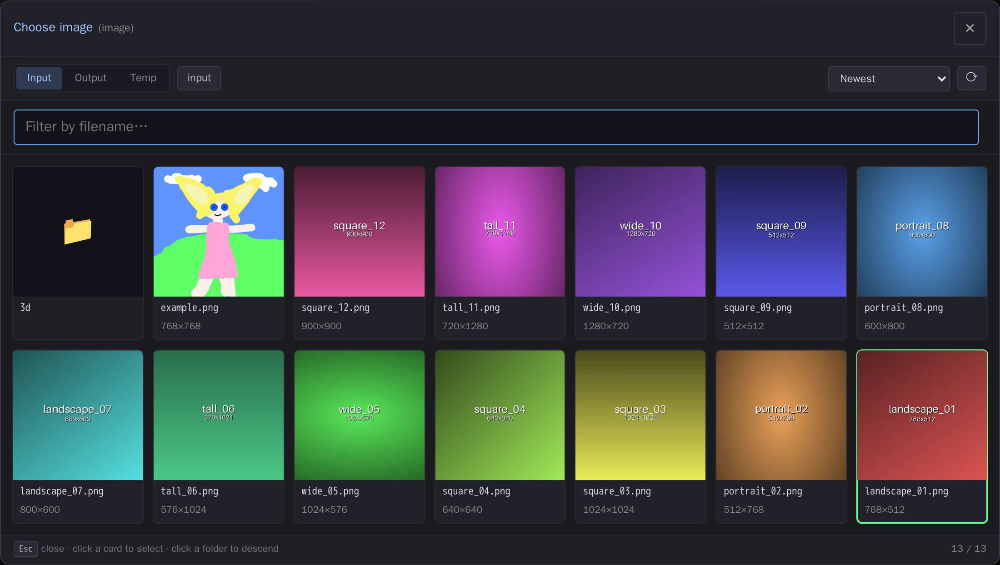

# comfyui-gallery-loader

Touch-friendly gallery picker for ComfyUI image, video and path widgets.

Four complementary entry points share one card-grid picker:

1. **`Load Image (Gallery)` node** — drop-in `LoadImage` replacement
   with the picker rendered inline on the node body. Cards scroll
   independently of the LiteGraph canvas, so it works on mobile and
   tablet.
2. **Modal picker over stock `LoadImage`** — clicking the `image`
   widget on any `LoadImage` / `LoadImageMask` / `LoadImageOutput`
   opens a card-grid modal with **Input / Output / Temp** tabs.
3. **Modal picker over the video and folder loaders** — core
   `LoadVideo`, plus VHS's `VHS_LoadVideo`, `VHS_LoadVideoFFmpeg` and
   `VHS_LoadImages`. Same three tabs, video posters on the cards, and a
   folder picker for the directory loader.
4. **Filesystem browser for VHS path-loader nodes** — `📁 Browse`
   button on `VHS_LoadImagePath`, `VHS_LoadImagesPath`,
   `VHS_LoadVideoPath`, and `VHS_LoadVideoFFmpegPath` opens the modal
   rooted at the ComfyUI install directory. Video files preview as
   `<video>` thumbnails; directory loaders get a footer "Use this
   folder" commit button.

## Why

ComfyUI's native image dropdown is alphabetical, single-column, and
unsearchable. The card grid is the same UX as the output panel:
mtime-sorted by default, fuzzy-searchable, with image thumbnails or
video posters. On mobile/tablet the grid is the only viable picker —
the native LiteGraph dropdown is unusable on touch.

## Install

ComfyUI Manager → "Install Custom Nodes" → search for **Gallery
Loader**. Or clone manually:

```sh
cd ComfyUI/custom_nodes
git clone https://github.com/laurigates/comfyui-gallery-loader
# restart ComfyUI; no Python deps beyond what ComfyUI core ships
```

## `Load Image (Gallery)` node



| Output  | Type   | Notes                                          |
|---------|--------|------------------------------------------------|
| `image` | IMAGE  | Same loading semantics as the core `LoadImage`. |
| `mask`  | MASK   | Alpha channel inverted, matching core.          |
| `path`  | STRING | Resolved on-disk path — handy for SaveImage filename reuse / metadata. |

The widget stores either an annotated path (`subdir/foo.png [output]`)
or a bare absolute path. Both forms resolve via
`folder_paths.get_annotated_filepath`.

## Modal over stock LoadImage



Click the `image` combo widget — instead of the native dropdown, the
modal opens with three source tabs:

| Tab    | Reads from               | Commits value as     |
|--------|--------------------------|----------------------|
| Input  | `ComfyUI/input/`         | `subdir/foo.png`     |
| Output | `ComfyUI/output/`        | `subdir/foo.png [output]` |
| Temp   | `ComfyUI/temp/`          | `subdir/foo.png [temp]`   |

The annotated values are resolved transparently by core `LoadImage`
via `folder_paths.get_annotated_filepath`. Existing workflows that
target `input/` keep using the bare-relative form — no value churn.

A `📁 Browse gallery` button is also added below the widget so the
picker is reachable even on frontends that hijack the combo's click
through the Vue Asset Browser overlay.

## Video and folder loaders

The same modal, the same three tabs, over the upload-flavour video and
directory combos:

| Node                  | Widget      | Mode      | Lists                                  |
|-----------------------|-------------|-----------|----------------------------------------|
| `LoadVideo` (core)    | `file`      | File      | `.mp4 .webm .mov .mkv .avi .m4v .mpg .mpeg` |
| `VHS_LoadVideo`       | `video`     | File      | `.webm .mp4 .mkv .gif .mov`            |
| `VHS_LoadVideoFFmpeg` | `video`     | File      | `.webm .mp4 .mkv .gif .mov`            |
| `VHS_LoadImages`      | `directory` | Directory | (folder picker)                        |

Every one of these resolves its value through
`folder_paths.get_annotated_filepath`, so the `[output]` / `[temp]`
forms load exactly like the bare input names their native dropdowns
offer — which is what lets you pick a render straight out of `output/`
without copying it into `input/` first.

The VHS video sets mirror VHS's own `video_extensions` list, so the
grid shows precisely what each node's native dropdown would. `.gif` is
in that list and renders as a still thumbnail rather than a `<video>`.

`VHS_LoadImages` opens **inside** its currently selected folder: file
cards are inert, clicking a folder descends, and the footer
**"Use this folder"** button commits. At a root the committed value is
`.` (which resolves to the root itself) rather than an empty string.

Video cards use a `<video preload="metadata">` poster, loaded lazily as
the card scrolls into view — the same treatment the VHS path loaders
already got. There is no `ⓘ` metadata button on a video card; the
metadata endpoint reads image formats only.

## VHS path-loader integration

VHS path widgets are detected via `widget.options.vhs_path_extensions`.
A `📁 Browse files` / `📁 Browse folder` button opens the modal in
path-mode, rooted at `folder_paths.base_path` (or inside the widget's
current value if set). Selected files commit as a raw absolute path —
the format VHS already accepts.

| Node                          | Mode      | Extensions      |
|-------------------------------|-----------|-----------------|
| `VHS_LoadImagePath`           | File      | Image formats   |
| `VHS_LoadImagesPath`          | Directory | (folder picker) |
| `VHS_LoadVideoPath`           | File      | Video formats   |
| `VHS_LoadVideoFFmpegPath`     | File      | Video formats   |

Directory mode: file cards render but are inert; clicking a folder
descends, clicking the footer **"Use this folder"** button commits
the current absolute path.

## Endpoints

| Route                         | Purpose                                                                 |
|-------------------------------|-------------------------------------------------------------------------|
| `GET /gallery_loader/list`    | Directory listing. Params: `type=input\|output\|temp\|path`, `subfolder`, `path`, `extensions` (CSV). Image dims (width/height) are populated for image entries only. |
| `GET /gallery_loader/base`    | Returns `base_path`, `input_dir`, `output_dir`, `temp_dir`, `user_dir`. Used by the modal to default VHS path-mode to the ComfyUI install root. |
| `GET /gallery_loader/thumb`   | Webp 512px thumbnail for images at an arbitrary absolute path. Managed-type listings use core `/api/view` directly. |
| `GET /gallery_loader/file`    | Streams a whitelisted-extension file (images + common video formats) at an absolute path. Used for video posters in path-mode where core `/api/view` doesn't apply. |

## Compatibility

- ComfyUI frontend `>= 1.40` (widget `onPointerDown` hook).
- Works alongside the legacy node combo and the modern Vue Asset
  Browser — the modal strips `image_upload` / `video_upload` from node
  specs before the widget is constructed, falling back to a plain
  canvas combo whose click we can intercept. `audio_upload` and
  `mesh_upload` combos are left alone; the picker can't serve them, so
  they keep their native control.

## License

MIT — see `LICENSE`.
